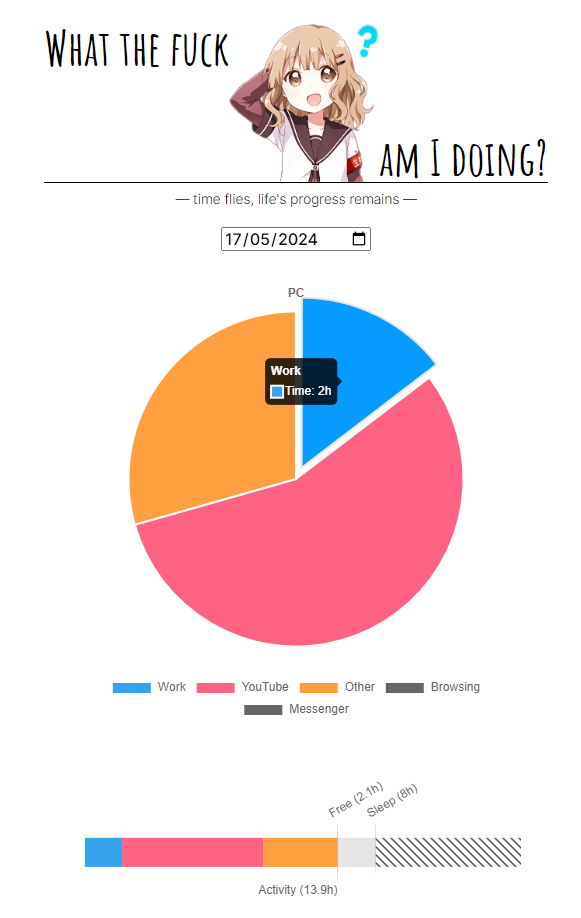

# About <a href="https://www.rust-lang.org/"></a> # About <a href="https://nodejs.org/en"></a><a href="https://github.com/UnexomWid/eryn"></a>


**WAID** or *What the fuck am I doing?* is a Windows tool that tracks how you use your time.

It has 2 components

- the Rust client (Windows-only), which detects what you're doing in real time and reports to the server
- the Node.js server which stores and shows you reports about how you spend your day

<p align="center">
  
</p>

# Installing

You first need to install [Rust](https://www.rust-lang.org/) and [Node](https://nodejs.org/en).

Then clone this repo and run the setup:

```sh
git clone https://github.com/UnexomWid/waid

cd waid

setup.bat
```

...and that's it ツ

# Configuration

The default configuration is ready to go. However, if you want to customize stuff (like activities based on window titles), continue reading.

## Client

You should see the file `client/waid.json`. You can edit the existing categories, which are used to detect what kind
of activity you are doing, based on the title of the window that you are focused on; `window_title` is a regex.

`user_inactive_threshold` (in seconds) means that if you are away from the computer longer than this, the program
will stop tracking what you do since you are away. Being away means not using your mouse or keyboard. When you come back,
it will resume.

`server.endpoint` is the server URL that the client will send requests to in order to send the data.
When the client sends the data successfully, it is erased locally. Make sure this matches what's in the server config.

`server.send_frequency` (also in seconds) is how often the client should report the data to the server. 5 mins aka 300s is
a good compromise.

## Server

You should see the file `server/config.json`. You can change the hostname/port. **Make sure they match what's in the client config**.

The server config also stores a color for each category, which is used for rendering charts.
The list of categories should be the same as in the client config.

# Usage

Just run:

```sh
start.bat
```

...which will open 2 terminal tabs: one for the server, and one for the client.

You have to keep both tabs open.

In the client terminal you'll see info like the current window title, detected activity, etc.

Every ~5 minutes, the client will send the data to the server. You can see statistics via the browser:

```
http://localhost:3010
```

Make sure to use the hostname/port from the server config file.

You can use the left/right arrow keys to move between days more quickly.

# How it works

Instead of looking at the current focused window, the tool looks at the window over which you are hovering your cursor.

Why? Because you could have focus on the Visual Studio window, while scrolling on Reddit.

It detects the window title, and picks the current activity based on the config file.

If you don't use your keyboard or mouse for a period of time (see the client config), the tool will stop tracking until you are active again.

The client periodically sends the tracked time for each activity to the server. If this is successful, it will erase the tracking data locally,
because it has been saved on the server.

The request to the server includes a secret which is configurable in the client and server configs, and they should obviously match.
This secret defaults to `placeholder` since the server is configured to run on localhost by default. If you want to host the server somewhere,
make sure to use a random secret so that no one else except your client can make updates on the server.

# Todo

- detect games made with Unity
- add more ways to detect activities (e.g. based on the process name)
- use a cache to store pairs of PID -> detected activity

# License <a href="https://github.com/UnexomWid/waid/blob/master/LICENSE"></a>

**WAID** was created by [UnexomWid](https://uw.exom.dev). It is licensed under [MIT](https://github.com/UnexomWid/waid/blob/master/LICENSE-MIT) OR [Apache 2](https://github.com/UnexomWid/waid/blob/master/LICENSE-APACHE).